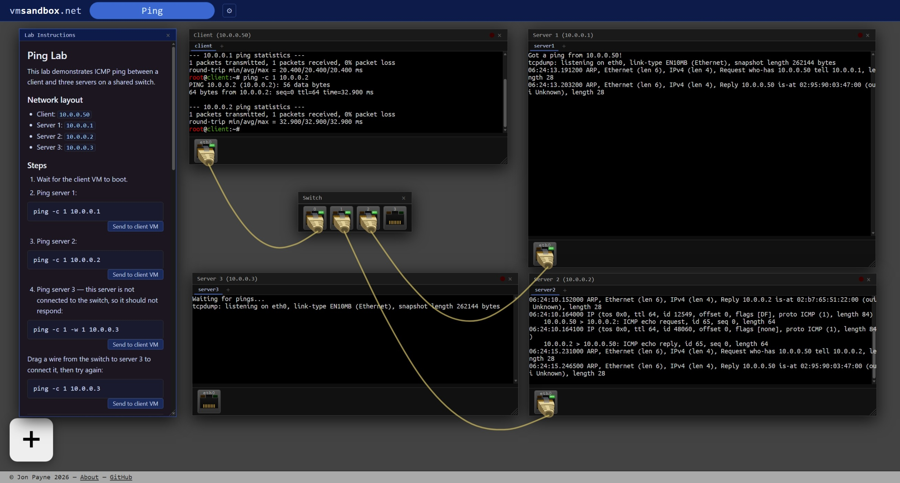

# vmsandbox.net

Browser-based Linux network emulator. Live demo: [vmsandbox.net](https://vmsandbox.net)



## Overview

vmsandbox.net runs real Linux VMs inside the browser using [TinyEMU](https://bellard.org/tinyemu/) compiled to WebAssembly. VMs boot a minimal Debian RISC-V system and can be connected together using virtual hubs and switches to form networks — all without any server-side compute.

**Features**

- **In-browser Linux VMs** — full RISC-V Linux v6.19 VMs using TinyEMU, no plugins or native installs required
- **Debian disk image** — VMs run a Debian Trixie based image 
- **Virtual networking** — connect VMs using emulated hubs and switches to build multi-machine topologies
- **Guided labs** — structured lab exercises walk users through networking concepts step by step; see [/topologies](/topologies) for available labs

---

## Building

### Prerequisites

Initialize git submodules before anything else:

```bash
git submodule update --init
```

#### Step 1 — Install host packages

```bash
sudo apt-get update
sudo apt-get install -y \
  build-essential libcurl4-openssl-dev libssl-dev \
  gcc-riscv64-linux-gnu \
  wget debootstrap qemu-user-static binfmt-support \
  e2fsprogs genext2fs uidmap xz-utils flex bison nodejs
```

#### Step 2 — Configure binfmt

Registers `qemu-riscv64-static` with the `F` (fix-binary) flag so RISC-V binaries run inside a chroot.

```bash
sudo tee /etc/binfmt.d/qemu-riscv64-static.conf <<'EOF'
:qemu-riscv64:M::\x7fELF\x02\x01\x01\x00\x00\x00\x00\x00\x00\x00\x00\x00\x02\x00\xf3\x00:\xff\xff\xff\xff\xff\xff\xff\x00\xff\xff\xff\xff\xff\xff\xff\xff\xfe\xff\xff\xff:/usr/bin/qemu-riscv64-static:OCF:
EOF
sudo systemctl restart systemd-binfmt
```

---

### Build steps

#### build-001 — TinyEMU native

Compiles TinyEMU for the host machine, producing the `temu` binary and the `splitimg` tool used to chunk disk images.

```bash
./build-001-tinyemu-native.sh
```

#### build-002 — TinyEMU WASM

Compiles TinyEMU to WebAssembly using Emscripten, producing `riscvemu64-wasm.js` and `riscvemu64-wasm.wasm` for in-browser use.

```bash
./build-002-tinyemu-wasm.sh
```

#### build-003 — OpenSBI firmware

Builds the OpenSBI `fw_jump` RISC-V firmware blob required to boot Linux under TinyEMU.

```bash
./build-003-opensbi.sh
```

#### build-004 — Configure kernel

Copies `vmsandbox_defconfig` into the Linux source tree and runs `make vmsandbox_defconfig` to generate the `.config` for a minimal RISC-V kernel.

```bash
./build-004-configure-kernel.sh
```

#### build-005 — Build kernel

Cross-compiles the Linux kernel for RISC-V. This step takes 3–5 minutes. Produces `assets/kernel.bin` and a zstd-compressed `kernel.bin.zst`.

```bash
./build-005-build-kernel.sh
```

#### build-006 — Build root filesystem

Uses `debootstrap` to build a minimal Debian Trixie RISC-V root filesystem, packages it as an ext2 disk image, and splits it into 256 KB chunks for browser streaming. Runs as root (self-elevates via sudo).

```bash
./build-006-build-rootfs.sh
```

#### build-007 — Optimize ext2 layout (optional)

Boots the VM with `temu` to capture a block-access log, then runs `ext2opt` to reorder the disk image so hot blocks appear at the front. Re-splits and compresses the result with zstd for faster initial load.

```bash
./build-007-ext2opt.sh
```

---

## Running locally

To run as a console application:

```bash
./run-temu.sh
```

To run in a browser:

```bash
./run-browser.sh
```

The app will be available at `http://localhost:5173` (or the next available port).
